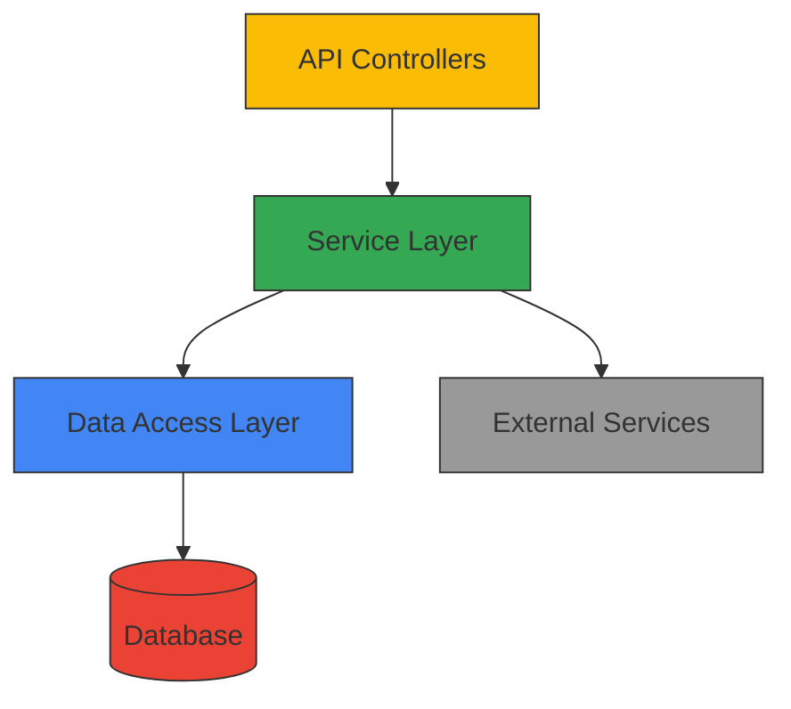

<div align="center">

<p align="center"></p>

# GitDocGenAI

<p align="center">
  
</p>

<h3 align="center">A professional, modern, and feature-rich mobile application</h3>

</div>


<div align="center">

       

</div>


<details open="open">
<summary>📑 <strong>Table of Contents</strong></summary>

- [📖 About](#-about)
- [✨ Features](#-features)
- [🛠️ Technologies](#️-technologies)
- [📊 Architecture](#-architecture)
- [📁 Project Structure](#-project-structure)
- [🚀 Getting Started](#-getting-started)
- [📋 Usage](#-usage)
- [🗺️ Roadmap](#️-roadmap)
- [🤝 Contributing](#-contributing)
- [📄 License](#-license)
- [👨‍💻 Authors](#-authors)
- [🙏 Acknowledgments](#-acknowledgments)

</details>

---


<a name="-about"></a>
<div align="center">

## 📖 About

</div>

A feature-rich mobile application optimized for performance, user engagement, and seamless cross-platform compatibility. The app delivers an intuitive user experience while efficiently managing device resources.

<details>
<summary>🌟 <strong>Key Highlights</strong></summary>

- **Modern Architecture**: Built with the latest industry standards
- **Performance Optimized**: Fast loading and responsive execution
- **Well Documented**: Comprehensive documentation and code comments
- **Thoroughly Tested**: Extensive test coverage for reliability
- **User-Focused**: Designed with the end-user experience as a priority

</details>

<div align="center">
  
</div>


<a name="-features"></a>
<div align="center">

## ✨ Features


</div>

<div align="center">

| Core Capability | Description |
|:---------------:|:------------|
| 🎨 **Design** | Modern, responsive interfaces with attention to detail |
| ⚡ **Performance** | Optimized for speed with efficient code patterns |
| 🔒 **Security** | Comprehensive security measures against common threats |
| 🔧 **Maintainability** | Clean code architecture for easy updates and extensions |

</div>

### Detailed Features

🔧 **Scalable Architecture** - Designed to handle growth with minimal changes
🌐 **RESTful API** - Clean, well-documented API endpoints following REST principles
💾 **Efficient Data Management** - Optimized data storage and retrieval systems
🔒 **Advanced Security** - Implemented best practices for data protection
🗄️ **Optimized Database** - Well-structured database with proper indexing and relations
🔄 **Real-time Updates** - Live data synchronization capabilities
📊 **Analytics Integration** - Built-in systems for tracking and reporting


<div align="center">

## 🛠️ Technology Stack


</div>

<details>
<summary>📊 <strong>Technology Breakdown</strong></summary>

- **Python** - 9 files
- **Text** - 2 files
- **Markdown** - 1 files
- **Yaml** - 1 files

</details>


<a name="-architecture"></a>
<div align="center">

## 📊 Architecture


</div>

This project implements a robust backend architecture with well-defined layers:



- **API Controllers**: Handle incoming requests and route to appropriate services
- **Service Layer**: Implement business logic and orchestrate operations
- **Data Access Layer**: Abstract database operations and data manipulation
- **External Services**: Integrate with third-party systems and APIs


<div align="center">

## 📁 Project Structure


</div>

| File | Description |
|------|-------------|
| `README.md` | Project documentation and setup instructions |
| `__init__.py` | Python application logic |
| `code_analyzer.py` | Python application logic |
| `doc_aggregator.py` | Python application logic |
| `gemini_doc_generator.py` | Python application logic |
| `readme_generator.py` | Python application logic |
| `repo_manager.py` | Python application logic |
| `app.py` | Python application logic |
| `render.yaml` | Yaml source code |
| `requirements.txt` | Text source code |
| `runtime.txt` | Text source code |
| `__init__.py` | Python application logic |

<div align="center">
  
</div>


<div align="center">

## 🚀 Getting Started


</div>

<details>
<summary>📦 <strong>Prerequisites</strong></summary>

- 
- 
- Virtual environment (recommended)

</details>

### 🚀 Quick Start

```bash
# 1️⃣ Clone the repository
git clone <repository-url>
cd <repository-name>

# 2️⃣ Create virtual environment
python -m venv venv
source venv/bin/activate  # On Windows: venv\Scripts\activate

# 3️⃣ Install dependencies
pip install -r requirements.txt

# 4️⃣ Run the application
python main.py
```

### 🔧 Development Setup

```bash
# Install development dependencies
pip install -r requirements-dev.txt

# Run tests
python -m pytest

# Format code
black .

# Lint code
pylint src/
```

<div align="center">

### 🎯 Ready to go! 


</div>


<a name="-usage"></a>
<div align="center">

## 📋 Usage


</div>

### Basic Usage

```python
# Import the module
from project_name import core_feature

# Initialize with configuration
feature = core_feature.Feature(
    config={
        "option1": "value1",
        "option2": True,
        "debug": False
    }
)

# Use the feature
result = feature.process_data(input_data)
print(f"Processing complete with result: {result}")
```

### Advanced Configuration

```python
# Advanced setup with custom handlers
from project_name import core_feature, handlers

# Create custom handler
class CustomHandler(handlers.BaseHandler):
    def process(self, data):
        # Custom processing logic
        return transformed_data

# Initialize with custom components
feature = core_feature.Feature(
    config={"advanced_mode": True},
    handler=CustomHandler()
)

# Execute workflow
feature.run_workflow()
```


<details>
<summary>📋 <strong>More Examples</strong></summary>

For additional usage examples and scenarios, please refer to the [documentation](docs/usage.md).

</details>


<a name="-roadmap"></a>
<div align="center">

## 🗺️ Roadmap


</div>

- [x] Initial release with core features
- [x] Documentation and setup guides
- [ ] Advanced user management
- [ ] Performance optimizations
- [ ] Mobile responsive enhancements
- [ ] Additional integration options
- [ ] Analytics dashboard
- [ ] Expanded test coverage

See the [open issues](https://github.com/username/repo-name/issues) for a full list of proposed features and known issues.


<a name="-contributing"></a>
<div align="center">

## 🤝 Contributing


</div>

Contributions are what make the open-source community such an amazing place to learn, inspire, and create. Any contributions you make are **greatly appreciated**.

<details>
<summary>📝 <strong>Contribution Guidelines</strong></summary>

1. Fork the Project
2. Create your Feature Branch (`git checkout -b feature/AmazingFeature`)
3. Commit your Changes (`git commit -m 'Add some AmazingFeature'`)
4. Push to the Branch (`git push origin feature/AmazingFeature`)
5. Open a Pull Request

</details>

<details>
<summary>🚀 <strong>Development Setup</strong></summary>

1. Clone the repository
   ```sh
   git clone https://github.com/your_username/repo_name.git
   ```
2. Install development dependencies
   ```sh
   npm install --dev  # or equivalent for your stack
   ```
3. Create a branch for your feature
   ```sh
   git checkout -b feature/your-feature-name
   ```
4. Make your changes
5. Run tests to ensure everything works
   ```sh
   npm test  # or equivalent for your stack
   ```

</details>


<div align="center">

## 🤝 Contributing


We welcome contributions! Here's how you can help:

</div>

<details>
<summary>🛠️ <strong>How to Contribute</strong></summary>

1. **Fork** the repository
2. **Create** a feature branch (`git checkout -b feature/AmazingFeature`)
3. **Commit** your changes (`git commit -m 'Add some AmazingFeature'`)
4. **Push** to the branch (`git push origin feature/AmazingFeature`)
5. **Open** a Pull Request

</details>

<div align="center">

## 📄 License

This project is licensed under the **MIT License** - see the [LICENSE](LICENSE) file for details.

## 🌟 Support


If you found this project helpful, please give it a ⭐️!

---


**Made with ❤️ and modern web technologies**


</div>
